<figure style="text-align: center;">
  
  <figcaption style="font-size: 0.9em; color: #555;">
    Logo oficial de Código Facilito.
  </figcaption>
</figure>

<h1 align="center">**Bootcamp QA Testing**</h1>


# Contexto y Objetivos del Proyecto

En el ámbito del desarrollo de software, garantizar una experiencia consistente y de alta calidad en todas las plataformas es fundamental para el éxito de cualquier producto digital. Sin embargo, en algunos casos, los usuarios reportan experiencias dispares entre diferentes componentes de una misma plataforma, como sucede con **Código Facilito**, esta reconocida plataforma educativa en el ámbito del desarrollo de software.

Actualmente, me encuentro participando en un **bootcamp de QA testing de software** , donde estoy adquiriendo habilidades técnicas y metodológicas para evaluar la calidad de aplicaciones web, APIs y aplicaciones móviles. Como parte de este proceso formativo, he decidido realizar un análisis integral de Código Facilito, una plataforma que utilizo regularmente para mi aprendizaje y que presenta un caso interesante de estudio debido a las diferencias en la percepción de sus usuarios.

Mientras que la **aplicación web** de Código Facilito es ampliamente elogiada por su diseño intuitivo, rendimiento y funcionalidades completas, su **aplicación móvil** ha recibido críticas significativas en términos de *usabilidad*, *rendimiento* y *estabilidad*. Este contraste plantea una pregunta clave: ¿qué factores podrían estar afectando negativamente la experiencia del usuario en la aplicación móvil?

El presente proyecto tiene como objetivo realizar un análisis integral de calidad sobre los servicios ofrecidos por Código Facilito, centrándose en tres áreas principales:

- **Página web**: Evaluar su funcionalidad, usabilidad y rendimiento para establecer un punto de comparación.
- **API**: Validar los endpoints disponibles, asegurando su correcto funcionamiento y tiempos de respuesta. (API genérica proporcionada por plataforma.)
- **Aplicación móvil**: Analizar las posibles causas detrás de las críticas negativas, evaluando aspectos como compatibilidad, navegación, rendimiento y experiencia del usuario.

A través de pruebas manuales y automatizadas, este trabajo práctico busca identificar áreas de mejora en la aplicación móvil y proporcionar recomendaciones basadas en evidencia para optimizar su calidad. Además, servirá como un portafolio práctico que refleje habilidades técnicas en herramientas y metodologías modernas de testing.

Este informe documentará los casos de prueba realizados, los resultados obtenidos y las conclusiones derivadas del proceso, ofreciendo una visión completa del estado actual de los servicios evaluados y contribuyendo al entendimiento de las diferencias entre las plataformas.

---

### Metodología General

Para garantizar una evaluación integral de los servicios ofrecidos por Código Facilito, se aplicaron diferentes herramientas y técnicas de testing, tanto manuales como automatizadas. A continuación, se detalla la metodología general utilizada en este proyecto:

#### Herramientas
- **Página web**: 
  - Pruebas Manuales.
  - Rendimiento: PageSpeed Insightse.
  - Accesibilidad.
- **API**: 
  - Manual y automatización: Postman.
- **Aplicación móvil**: 
  - Simuladores/Emuladores: Android Studio Emulator.
  - Dispositivos físicos.

#### Tipos de Pruebas
- **Funcionales**: Verificación de flujos clave (login, navegación, reproducción de videos, etc.).
- **Rendimiento**: Evaluación de tiempos de carga y respuesta.
- **Usabilidad**: Análisis de la experiencia del usuario y diseño responsive.
- **Compatibilidad**: Pruebas en diferentes navegadores, dispositivos y sistemas operativos.

#### Entorno de Pruebas
- **Página web y API**: Pruebas realizadas en entornos locales.
- **Aplicación móvil**: Pruebas realizadas en emuladores (Android Studio Emulator) y dispositivos físicos (Android e iOS).
- **Sistemas Operativos:**
  - Microsoft Windows 10 Pro
  - Debian GNU/Linux 12
- **Navegadores Probados**:
  - Google Chrome (Version 133.0.6943.127 (Official Build) (64-bit))
  - Mozilla Firefox (Versión 135.0.1 (64-bit))
  - Microsoft Edge (Versión 133.0.3065.82 (Compilación oficial) (64 bits)
  - Brave (Versión 1.75.180).

#### Enfoque
- Se combinaron pruebas manuales y automatizadas para cubrir diferentes escenarios.
- Las pruebas manuales se centraron en explorar problemas visuales y de usabilidad.
- Las pruebas automatizadas se utilizaron para validar flujos repetitivos.  

---  

### Casos de Prueba de Funcionalidad:
    A continuación, se detallan los casos de prueba ejecutados para evaluar la funcionalidad de la página web: 

| **ID**   | **Caso de Prueba**         | **Descripción**                                                                 | **Pasos**                                                                                                                                                                                                 | **Resultado Esperado**                                                   |
|----------|---------------------------|---------------------------------------------------------------------------------|---------------------------------------------------------------------------------------------------------------------------------------------------------------------------------------------------------|--------------------------------------------------------------------------|
| **PF01** | Registro de Usuario       | Verificar que los usuarios puedan crear una cuenta correctamente                | 1. Acceder a la página de registro. <br> 2. Ingresar datos válidos en los campos obligatorios (nombre, apellido, correo electronico, contraseña). <br> 3. Hacer clic en "Registrar".                                             | El usuario es registrado exitosamente y recibe un email de "Confirmar mi correo". |
| **PF02** | Inicio de Sesión          | Validar que el inicio de sesión funcione correctamente                          | 1. Acceder a la página de login. <br> 2. Ingresar credenciales válidas (correo y contraseña). <br> 3. Hacer clic en "Iniciar sesión". <br> 4. Tambien se puede iniciar sesión directamente con cuenta de Facebook o Google.                                                                | El usuario accede a su cuenta sin errores.                               |
| **PF03** | Búsqueda de Cursos        | Comprobar que la búsqueda de cursos funcione correctamente                      | 1. Navegar a la página principal. <br> 2. Ingresar una palabra clave en el campo de búsqueda (ejemplo: "Python"). <br> 3. Presionar "Buscar".                                                             | Se muestran resultados relevantes para la palabra clave ingresada.       |
| **PF04** | Reproducción de Videos    | Verificar que los videos se reproduzcan sin problemas                          | 1. Navegar a un curso con videos disponibles. <br> 2. Hacer clic en el botón de reproducción de un video.                                                                                                | El video se reproduce sin interrupciones ni errores.                     |
| **PF05** | Navegación entre Secciones| Validar que los enlaces internos redirijan a las páginas correctas              | 1. Hacer clic en cada enlace del menú de navegación (aprende, productos, perfil, mis cursos, mis bootcamps, etc.). <br> 2. Verificar que se cargue la página correspondiente.                                                           | Cada enlace lleva a la página esperada.                                  |

---

### Reporte de Bugs

Durante las pruebas, se identificaron los siguientes bugs:

#### **BUGPF01: Mensaje de Confirmación de Inicio de Sesión con Cuenta de Google no aparece**
- **Descripción**: El mensaje "Iniciaste sesión correctamente" no aparece al iniciar sesión con cuenta de Google.
- **Pasos para Reproducir**:
  1. Acceder a la página de login.
  2. Hacer clic en el botón "Ingresar con Google".
  3. Completar el flujo de autenticación con una cuenta de Google válida.
  4. Observar si aparece el mensaje "Iniciaste sesión correctamente".
- **Resultado Esperado**: El mensaje "Iniciaste sesion correctamente" debe mostrarse.
- **Resultado Obtenido**: El mensaje no se muestra.
- **Gravedad**: Media
- **Prioridad**: Media
- **Tipo de Error**: Consistencia de Interfaz de Usuario (UI)
- **Capturas de Pantalla**: A continuacion.

---

Inicio de Sesión con credenciales (email, password):

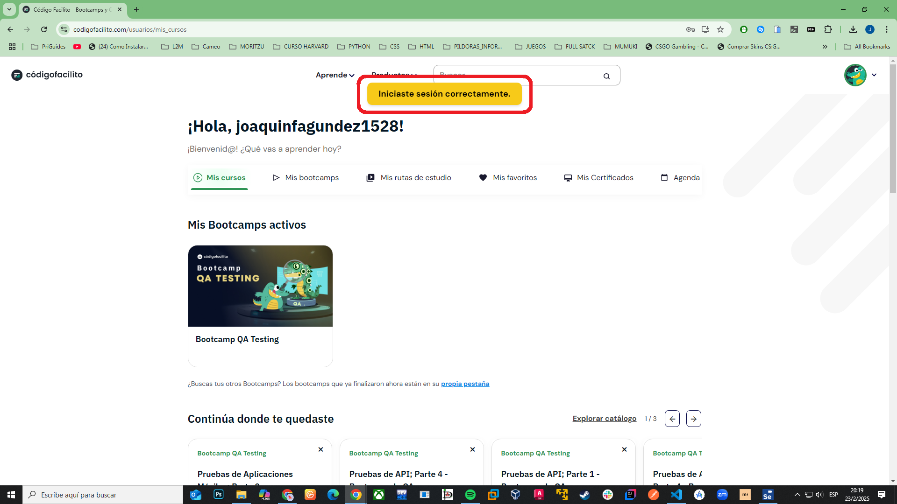

---

Inicio de Sesión con cuenta Google:

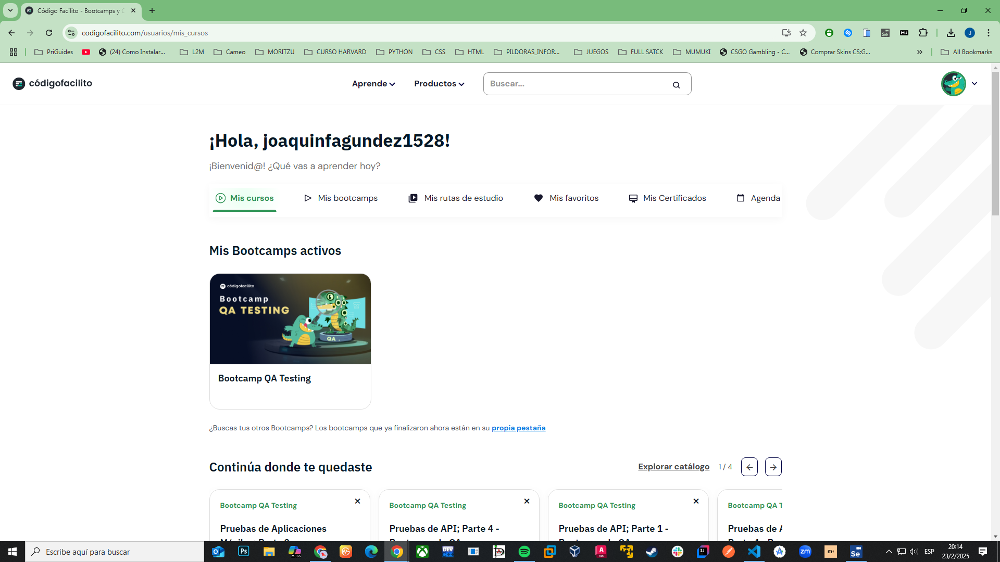

---
### Rendimiento:

Dicha evaluación de una página web es crucial para garantizar una experiencia óptima del usuario. Para este proyecto, se seleccionó **Google PageSpeed Insights** como herramienta principal debido a su consistencia y enfoque en métricas clave. A continuación, se detalla la justificación técnica detrás de esta decisión.

### Razón de la Elección de PageSpeed Insights sobre Lighthouse

La evaluación del rendimiento de una página web es crucial para garantizar una experiencia óptima del usuario. Para este proyecto, se seleccionó **Google PageSpeed Insights** como herramienta principal debido a su consistencia y enfoque en métricas clave. A continuación, se detalla la justificación técnica detrás de esta decisión.

#### **1. Diferencias en el Entorno de Ejecución**
- **PageSpeed Insights**:
  - Ejecuta los análisis en una máquina estándar proporcionada por Google, garantizando condiciones de prueba consistentes en cada ejecución.
  - Este entorno controlado elimina variaciones causadas por factores externos, como la red local o el hardware del dispositivo utilizado.
- **Lighthouse**:
  - Puede ejecutarse tanto en un entorno local (por ejemplo, desde Chrome DevTools) como en un servidor remoto.
  - Sin embargo, al ejecutarse localmente, las métricas pueden verse afectadas por la red, la carga del sistema o la configuración del navegador, introduciendo variabilidad en los resultados.

#### **2. Simulación vs. Ejecución Real**
- **PageSpeed Insights**:
  - Utiliza datos reales de usuarios (cuando están disponibles) para complementar las mediciones realizadas en su entorno controlado.
  - Las simulaciones de dispositivos móviles y redes lentas son más confiables, ya que no dependen de configuraciones locales.
- **Lighthouse**:
  - Simula condiciones específicas (como redes 3G o dispositivos móviles) utilizando el entorno local donde se ejecuta.
  - Esto puede llevar a resultados menos precisos si el entorno local no está optimizado para simular dichas condiciones.

#### **3. Métricas y Enfoque**
- **PageSpeed Insights**:
  - Proporciona métricas clave ampliamente reconocidas, como **FCP (First Contentful Paint)**, **LCP (Largest Contentful Paint)**, **CLS (Cumulative Layout Shift)** y **TBT (Total Blocking Time)**.
  - Estas métricas están alineadas con las recomendaciones de **Core Web Vitals**, facilitando la identificación de áreas específicas de mejora.
- **Lighthouse**:
  - Aunque incluye métricas similares, ofrece auditorías adicionales sobre SEO, accesibilidad y mejores prácticas de desarrollo.
  - Estas auditorías, aunque útiles, son menos relevantes para el objetivo específico de este proyecto, que es evaluar el rendimiento de la página web.

#### **4. Facilidad de Uso**
- **PageSpeed Insights**:
  - Es una herramienta basada en la web, lo que elimina la necesidad de configuraciones técnicas o instalaciones adicionales.
  - Simplemente ingresando la URL de la página, se obtienen resultados detallados en cuestión de segundos.
- **Lighthouse**:
  - Requiere una configuración más avanzada, especialmente si se desea ejecutarlo desde la línea de comandos o integrarlo en un flujo de trabajo automatizado.
  - Su complejidad puede ser innecesaria para el alcance de este proyecto.

#### **Conclusión**
_La elección de **PageSpeed Insights** se basa en su capacidad para proporcionar mediciones consistentes y confiables en un entorno controlado. Esto garantiza que los resultados sean precisos, reproducibles y relevantes para este proyecto. Además, su enfoque en métricas clave de rendimiento y su facilidad de uso lo convierten en la herramienta más adecuada para cumplir con los objetivos establecidos_.

### Resultados Detallados de la Evaluación de Rendimiento

A continuación, se presentan las métricas clave obtenidas mediante **Google PageSpeed Insights** para evaluar el rendimiento de la página web en dispositivos móviles y desktop.

#### **Comparativa de Métricas**

| **Métrica**                     | **Escritorio** | **Móvil** | **Evaluación General**                                                                 |
|---------------------------------|----------------|-----------|---------------------------------------------------------------------------------------|
| **Largest Contentful Paint (LCP)** | 2.6 s         | 3.5 s     | Bueno en escritorio (< 2.5 s ideal), mejorable en móvil (> 2.5 s).                     |
| **Interaction to Next Paint (INP)** | 69 ms         | 186 ms    | Excelente en escritorio (< 200 ms), aceptable en móvil (cerca del límite).             |
| **Cumulative Layout Shift (CLS)**   | 0.01          | 0.03      | Excelente en ambos casos (< 0.1).                                                     |
| **First Contentful Paint (FCP)**    | 2.1 s         | 3.1 s     | Mejorable en ambos casos (< 1.8 s ideal).                                             |
| **Time to First Byte (TTFB)**       | 0.9 s         | 1 s       | Excelente en ambos casos (< 1 s ideal).                                               |

#### **Interpretación de los Resultados**

- **LCP**: **Renderizado del contenido más grande**
  - Escritorio: 2.6 s (Bueno, pero mejorable).
  - Móvil: 3.5 s (Mejorable, especialmente en conexiones lentas).
- **INP**: **Tiempo de respuesta a la interacción**
  - Escritorio: 69 ms (Excelente).
  - Móvil: 186 ms (Aceptable, pero cercano al límite).
- **CLS**: **Desplazamiento acumulado del diseño**
  - Ambos: Excelente (0.01 en escritorio, 0.03 en móvil).
- **FCP**: **Primer renderizado de contenido**
  - Ambos: Mejorable (2.1 s en escritorio, 3.1 s en móvil).
- **TTFB**: **Tiempo hasta el primer byte**
  - Ambos: Excelente (0.9 s en escritorio, 1 s en móvil).

#### **Recomendaciones para Mejorar el Rendimiento**

##### **Para Móviles**
1. Optimizar imágenes y usar formatos modernos como WebP.
2. Reducir scripts bloqueantes y priorizar la carga crítica.
3. Implementar lazy loading para recursos no esenciales.
4. Usar una CDN para reducir la latencia de red.

##### **Para Escritorio**
1. Priorizar la carga de CSS y JavaScript críticos.
2. Monitorear INP para mantener una respuesta rápida.
3. Reducir FCP optimizando el HTML y CSS iniciales.

---

### Evaluación de Accesibilidad

Para evaluar la accesibilidad de la página web, se utilizaron herramientas automatizadas como **PageSpeed Insights** junto con pruebas manuales. A continuación, se presentan los resultados obtenidos y las áreas de mejora identificadas.

#### **Hallazgos Críticos**

- **Videos sin Subtítulos**:
  - Durante las pruebas, se identificó que los videos disponibles en la plataforma no cuentan con herramientas de subtitulado ni transcripciones.
  - Esto afecta negativamente la experiencia de usuarios con discapacidad auditiva y aquellos que dependen de subtítulos para comprender el contenido.

#### **Impacto del Problema**

- **Usuarios con Discapacidad Auditiva**:
  - Los subtítulos son esenciales para que estos usuarios puedan acceder al contenido de los videos.
- **Usuarios en Entornos Silenciosos o Ruidosos**:
  - Sin subtítulos, los videos no son accesibles en situaciones donde el audio no puede ser reproducido o escuchado claramente.
- **Cumplimiento de Estándares WCAG**:
  - Este problema viola el principio de **Perceptible** del estándar WCAG, que establece que toda la información debe ser accesible a todos los usuarios, independientemente de sus capacidades.

#### **Capturas de Pantalla**

- **Video sin Subtítulos**:
  

#### **Recomendaciones para Mejorar la Accesibilidad de los Videos**

1. **Agregar Subtítulos Automáticos o Manuales**:
   - Implementa subtítulos para todos los videos utilizando herramientas como YouTube, Rev.com o Otter.ai.

2. **Incluir Transcripciones Textuales**:
   - Junto con los videos, proporciona una transcripción textual completa que los usuarios puedan leer.

3. **Usar Herramientas de Subtitulado Dinámico**:
   - Implementa herramientas como Amara o Kapwing para agregar subtítulos de manera dinámica.

4. **Transcripción Automática**:
   - Usar una herramienta como **Google Cloud Speech-to-Text** o **Azure Speech Services** para generar transcripciones automáticas del audio de los videos.
  
### **5. Conclusión**

Integrar una API de traducción en el contexto de **Código Facilito** sería una solución efectiva para resolver el problema de videos sin subtítulos. Además, esta solución no solo mejora la accesibilidad, sino que también amplía la audiencia y cumple con estándares internacionales de calidad.

> [!NOTE] 
> "No se realizaron pruebas de seguridad en la aplicación web para evitar violaciones de términos de servicio. ":crocodile: 

</br> 
</br>


---
# Prueba API con POSTMAN 


## Análisis Integral API genérica de Código Facilito - Evaluación de la API

## Introducción
Esta parte del proyecto tiene como objetivo evaluar la calidad de la API genérica de Código Facilito mediante pruebas funcionales y de seguridad. Se utilizaron herramientas como Postman para realizar las pruebas y validar los endpoints disponibles.

## Metodología
- **Herramientas**: Postman para pruebas manuales y scripts de validación.
- **Tipos de Pruebas**:
  - Funcionales: Verificar el correcto funcionamiento de los endpoints.
  - Seguridad: Evaluar vulnerabilidades como inyección SQL y autenticación.

## Casos de Prueba

### Caso de Prueba 1: Registro de Usuario
- **Descripción**: Verificar que un usuario pueda registrarse correctamente.
- **Endpoint**: `POST /api/v1/register`
- **Request Body**:
  ```json
  {
    "first_name": "{{$randomFullName}}",
   "last_name": "{{$randomLastName}}",
   "email": "{{$randomEmail}}",
   "pin": "1234"
  }

### Script de Validacion:


```javascript
pm.test("Status code is 201", function () {
    pm.response.to.have.status(201);
});

pm.test("Response has token", function () {
    const jsonData = pm.response.json();
    pm.expect(jsonData.token).to.be.a('string');
});
```
- **Resultado Esperado:** Respuesta HTTP 201 con un token JWT.

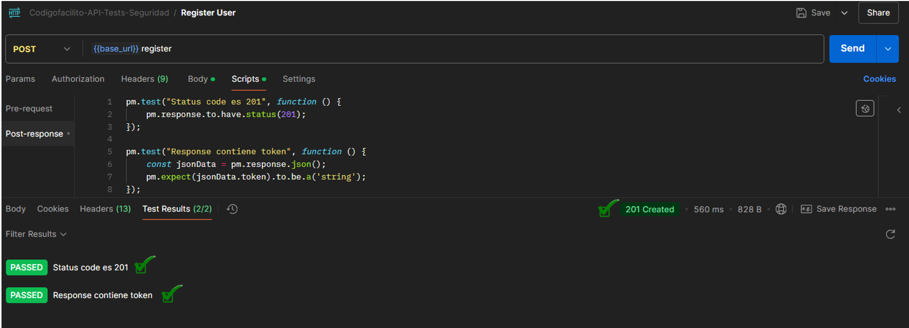

---
## Caso de Prueba 2: Inicio de Sesión
- **Descripción** : Validar que un usuario pueda iniciar sesión correctamente.
- **Endpoint** : POST /api/v1/login
- **Request Body**:

```json
{
  "account_number": 12345,
  "pin": "1234"
} 
```
### Script de Validacion:

```javascript
pm.test("Status code es 200", function () {
    pm.response.to.have.status(200);
});

pm.test("Response contiene token", function () {
    const jsonData = pm.response.json();
    pm.expect(jsonData.token).to.be.a('string');
});

// Guarda el token JWT en una variable de entorno
const token = pm.response.json().token;
pm.environment.set("auth_token", token);
```
  - **Resultado Esperado** : Respuesta HTTP 200 con un token JWT.

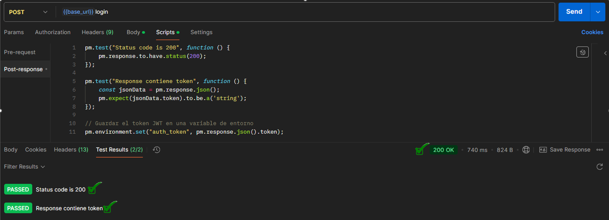

---
## Caso de Prueba 3: Obtener Todas las Cuentas

- **Descripción** : Verificar que un usuario autenticado pueda obtener sus cuentas.
- **Endpoint** : GET /api/v1/accounts
- **Headers** :

      Authorization : Bearer {{auth_token}}

### Scripts de Validación :

```javascript
pm.test("Validar acceso autorizado", function () {
    pm.response.to.have.status(200);
});

pm.test("No exponer datos sensibles", function () {
    const jsonData = pm.response.json();
    pm.expect(jsonData[0]).to.not.have.property("password");
});
```

- **Resultado Esperado** : Respuesta HTTP 200 con lista de cuentas.

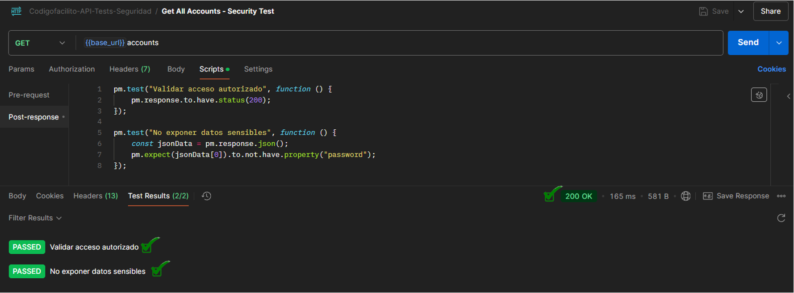

---

## Caso de Prueba 4: Inyección SQL

- **Descripción** : Evaluar la vulnerabilidad de inyección SQL en la aplicación mediante la manipulación de entradas de usuario en el endpoint objetivo.
- **Endpoint** : PUT /api/v1/users/{id}
- **Request Body** :

```json
{
  "first_name": "John'; DROP TABLE users; --",
  "last_name": "Doe"
}
```
> [!NOTE]
> **Análisis del Payload**:
>  
>El valor de ***first_name*** contiene una secuencia diseñada para explotar vulnerabilidades en aplicaciones web que no manejan correctamente las entradas del usuario:
>
>1. ***' (Comilla simple)***: Cierra prematuramente una consulta SQL.
>2. ***; (Punto y coma)***: Finaliza la consulta actual, permitiendo ejecutar una nueva.
>3. ***DROP TABLE users;***: Intenta eliminar la tabla users.
>4. **-- (Comentario en SQL)**: Ignora el resto de la consulta original, evitando errores de sintaxis.

### Scripts de Validación:

```javascript
pm.test("Rechazar inyección SQL", function () {
    pm.expect(pm.response.code).to.be.oneOf([400, 422]);
});
```

- **Resultado Esperado** : Respuesta HTTP 400 o 422 rechazando el payload malicioso.

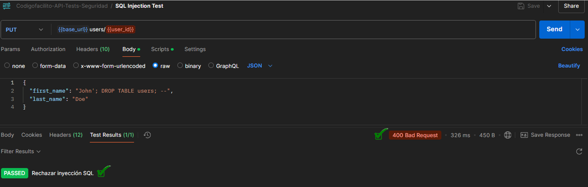

---

## Caso de Prueba 5: Acceso sin Token

- **Descripción** : Verificar que la API rechace solicitudes sin token.
- **Endpoint** : GET /api/v1/accounts
- **Scripts de Validación** :

```javascript
pm.test("Validar respuesta 401 sin token", function () {
    pm.response.to.have.status(401);
});
```

- **Resultado Esperado** : Respuesta HTTP 401 indicando falta de autenticación.
  
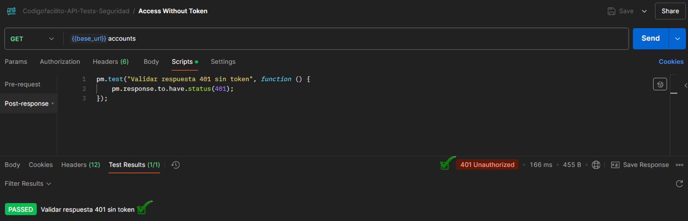

---

## Caso de Prueba 6: Token Inválido

- **Descripción** : Verificar que la API rechace tokens inválidos.
- **Endpoint** : GET /api/v1/accounts
- **Headers** :

      Authorization: Bearer invalid_token

- **Script de Validación** :

```javascript
pm.test("Validar respuesta 401 con token inválido", function () {
    pm.response.to.have.status(401);
});
```
- **Resultado Esperado** : Respuesta HTTP 401 indicando token inválido.

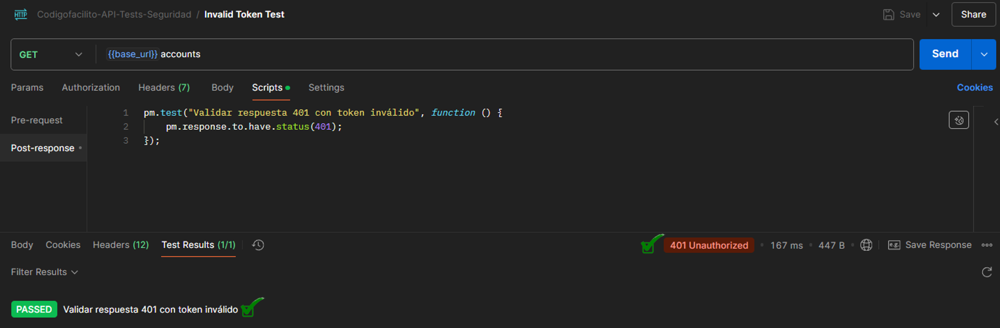

---

## Conclusión

_Las pruebas realizadas abarcaron tanto funcionalidad como seguridad, evaluando el correcto comportamiento de los endpoints en escenarios como registro, inicio de sesión y obtención de cuentas. Además, se analizaron posibles vulnerabilidades, como la inyección SQL y el control de acceso. Los resultados destacan la importancia de validar entradas, gestionar correctamente la autenticación y aplicar buenas prácticas de seguridad para garantizar la integridad y el correcto funcionamiento de la API._

</br> 
</br>


---

# Prueba APP MOVIL 


# **Informe de Pruebas de la Aplicación Móvil "CodigoFacilito"**

## **1.Introducción**

La aplicación móvil de **Código Facilito** es una herramienta clave para acceder a contenido educativo sobre desarrollo de software desde dispositivos móviles. Sin embargo, los usuarios han reportado problemas significativos relacionados con la usabilidad , rendimiento y estabilidad .

Este informe documenta las pruebas manuales realizadas para evaluar la calidad de la aplicación móvil. Se identifican áreas clave para mejorar la experiencia del usuario y se proporcionan recomendaciones basadas en evidencia. Las pruebas cubren las siguientes áreas:

- **Funcionalidad** : Verificación de flujos clave como login, navegación y reproducción de videos.

- **Usabilidad** : Análisis de la experiencia del usuario.
  
- **Compatibilidad** : Pruebas en diferentes dispositivos, sistemas operativos y condiciones de red (4g,5g,WiFi).
 
- **Accesibilidad** : Verificación de estándares como WCAG.

- **Permisos y Configuraciones** : Revisión de permisos solicitados y adaptación a configuraciones del dispositivo.

- **Pruebas Exploratorias** : Identificación de bugs y problemas no cubiertos por pruebas estructuradas.

---

## **2. Dispositivos Probados**
| Dispositivo            | Tipo      | Resolución                  | Procesador                     | Sistema Operativo            | Condiciones de Red      |
|------------------------|----------|-----------------------------|--------------------------------|------------------------------|-------------------------|
| Xiaomi POCO X6 PRO    | Físico   | 1.5K (1220 x 2712 píxeles)  | MediaTek Dimensity 8300 Ultra | Xiaomi HyperOS Android 14   | 4G, 5G, WiFi           |
| Motorola G72         | Físico   | Full HD+ (1080 x 2460 píxeles) | Mediatek Helio G99            | Android 13                  | 4G, WiFi               |
| iPhone 11 Pro Max     | Físico   | OLED (2688 x 1242 píxeles)  | Apple A13 Bionic              | iOS 13                       | 4G, WiFi               |
| Pixel Tablet         | Emulado  | 2560 x 1600 píxeles        | Android Virtual Processor     | Android 15                   | No aplica              |

---

## **3. Pruebas Realizadas y Evidencia**

### **3.1 Funcionalidad**
Se verificaron los flujos clave:
- **Login:** Sin errores con credenciales correctas.
- **Navegación:** Correcta en todos los dispositivos.
- **Reproducción de videos:** Funcional en todos los dispositivos.
-  **Comportamiento destacado**: La aplicación pausa automáticamente los videos cuando entra una llamada o aparece una notificación importante. Este comportamiento fue consistente en todos los dispositivos fisicos probados.
    >- **Resultado esperado**: El video debe pausarse automáticamente durante interrupciones importantes.
    >- **Resultado obtenido**: El video se pausa correctamente en todos los casos.

📌 **Evidencia:**

- **Video general** mostrando el proceso de login, navegación y reproducción de videos.
- (evidencias.md)
  
<video controls src="videos/login_navega_reproduccion.mp4" title="Title"></video>
- **Video** mostrando pausa del reproductor durante llamada entrante.
- (evidencias.md)
  
  <video controls src="videos/llamada_entrante.mp4" title="Title"></video>
  -(evidencias.md) 

---

### **3.2 Usabilidad**
Se analizaron diferencias en la experiencia del usuario entre la web y la app móvil:

| Diferencia | Web | App Móvil | Observación |
|------------|-----|----------|-------------|
| **Mi Progreso** | Muestra cursos hechos y progreso | Solo muestra puntos y cursos completados | Falta información clave en la app |
| **Mi Cuenta** | Contiene perfil, plan y pagos | Solo muestra email y cambio de contraseña | Interfaz limitada |
| **Cambio de contraseña** | Permitido | No permitido | Es un problema de UX/seguridad |
| **Cierre de sesión** | No se cierra al cerrar el navegador | Permanece iniciada tras cerrar la app | ¿Es intencional o un bug? |
| **Manejo de errores en login** | Mensaje claro en cada campo | Mensaje genérico "Usuario o contraseña incorrectos" | Debería mejorarse la retroalimentación |

📌 **Evidencia:**

<video controls src="videos/progreso_cuenta_web.mp4" title="Title"></video>
(web)

<video controls src="videos/progreso_cuenta_movil.mp4" title=""></video>
(movil)

- Videos mostrando las diferencias en "Mi Progreso" y "Mi Cuenta" entre web y móvil.

📌 **Recomendaciones y soluciones:**
- Unificar la experiencia entre la web y la app móvil para evitar confusión.
- Incluir la opción de cambio de contraseña en la app móvil.
- Mejorar los mensajes de error en el login para una mejor experiencia del usuario.

---

### **3.3 Compatibilidad**
Las pruebas se realizaron en diferentes dispositivos, sistemas operativos y condiciones de red. Se observaron pequeñas diferencias en los tiempos de carga, pero no se encontraron problemas de funcionalidad.

- No es necesario un video, ya que los tiempos de carga son la única diferencia.

📌 **Recomendaciones y soluciones:**
- Optimizar el rendimiento en dispositivos de gama media si los tiempos de carga son significativamente mayores.

---

### **3.4 Accesibilidad**
- **Videos sin subtítulos** en la web y la app móvil.
- **Permisos:** Solo se solicita permiso de notificaciones (en algunos dispositivos como Xiaomi POCO X6 PRO).  

📌 **Evidencia:**


- Captura de pantalla mostrando que los videos no tienen subtítulos.

📌 **Recomendaciones y soluciones:**
- Implementar subtítulos en todos los videos para mejorar la accesibilidad.


---

## **4. Hallazgos y Problemas Críticos**
### **4.1 Problemas Críticos**
| **Problema**                                    | **Impacto**                                                                                     | **Gravedad** | **Prioridad** | **Recomendación**                                                                                   |
|-------------------------------------------------|-------------------------------------------------------------------------------------------------|--------------|---------------|-----------------------------------------------------------------------------------------------------|
| **Cambio de contraseña no permitido en la app móvil** | Representa un riesgo de seguridad y afecta la experiencia del usuario al no poder gestionar su cuenta. | Alta         | Alta          | Implementar la funcionalidad de cambio de contraseña directamente en la app móvil, siguiendo estándares de seguridad como cifrado HTTPS. |
| **Falta de subtítulos en videos**               | Limita el acceso al contenido para usuarios con discapacidad auditiva o en entornos sin audio.  | Media        | Alta          | Agregar subtítulos automáticos o manuales a todos los videos, cumpliendo con estándares WCAG para accesibilidad. |
| **Cierre de sesión en app móvil no automático** | Puede generar riesgos de seguridad si el dispositivo es compartido, además de confusión en la experiencia del usuario. | Media        | Media         | Evaluar si es necesario cerrar la sesión automáticamente al salir de la app. |
| **Diferencias entre web y app en "Mi Progreso" y "Mi Cuenta"** | Genera inconsistencias en la experiencia del usuario y confusión sobre la información disponible. | Media        | Alta          | Unificar la información entre la web y la app móvil, asegurando que ambas plataformas muestren los mismos datos y funcionalidades. |

---

## **5. Informe sobre la Falta de Disponibilidad en iOS**
Actualmente, la aplicación móvil no se encuentra disponible para dispositivos iOS, lo que excluye una parte importante del mercado de usuarios potenciales.


### **5.1 Impacto en el Mercado**
| Sistema Operativo | Cuota de Mercado Global (%) |
|------------------|----------------------------|
| Android         | 71.6%                        |
| iOS            | 27.6%                        |
| Otros          | 0.8%                         |

- **Público perdido:** Al menos un 27.6% de usuarios no pueden acceder a la aplicación.  
- **Competencia:** Aplicaciones educativas similares ofrecen soporte en ambas plataformas.  
- **Experiencia del usuario:** Usuarios de iOS pueden sentirse excluidos, lo que reduce la adopción y retención de usuarios.  

### **5.2 Evidencia de Usuarios Solicitando la App en iOS**
Varios usuarios han manifestado su interés en una versión para iOS en la App Store:

> *"Quería descargarla en mi iPhone, pero no está disponible en la App Store. ¿Planean lanzarla pronto?"* – Usuario X> 

>*"Estaria genial ver una version de la app para iOS y iPadOS... Me suscribi ya que entre otras ideas me gustaba la idea de poder descargar los cursos y llevarlos conmigo pero resulta que no hay app para iOS...Me siento discriminado"* - Play Store.
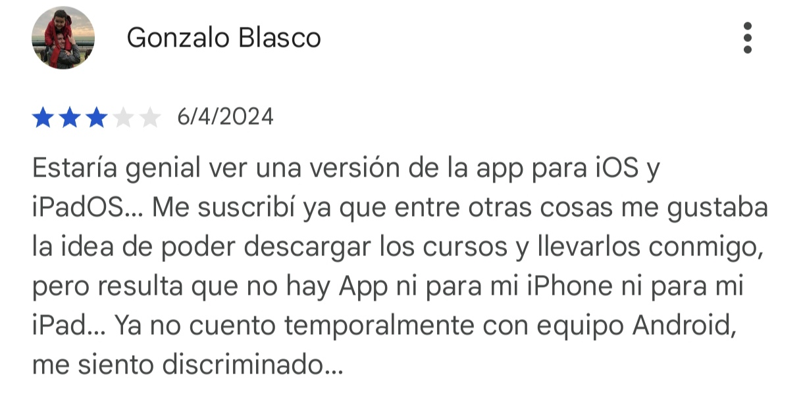


> *"Es una pena que solo esté en Android. Uso iOS y me gustaría probarla."* – Foro reddit

📌 **Evidencia:**

Pantalla inicio iPhone 11 Pro max:

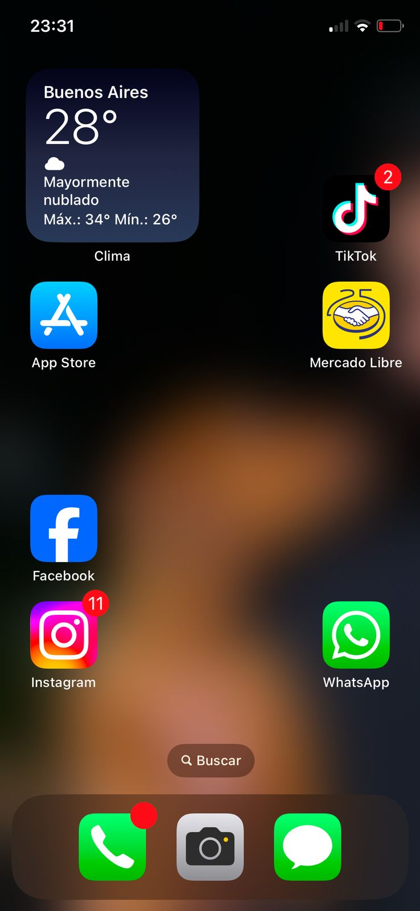

Busqueda App Store: (sin espacio)

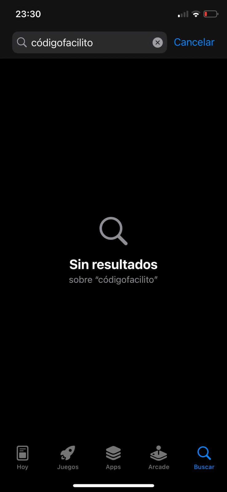

Busqueda App Store: (con espacio)

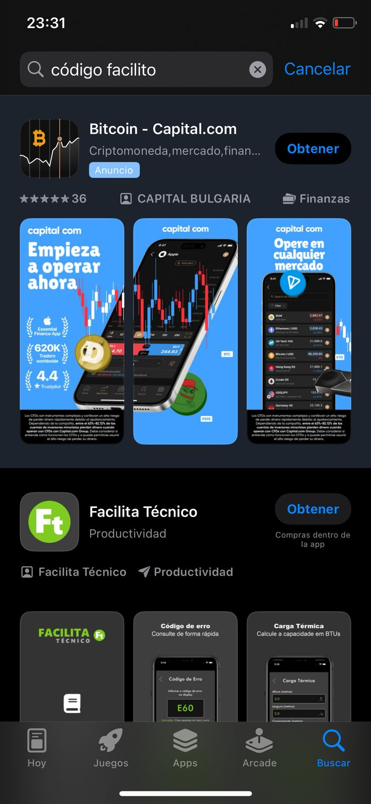

📌 **Recomendaciones y soluciones:**
- Evaluar el desarrollo de una versión para iOS.
- Ofrecer una PWA (Progressive Web App) como alternativa temporal.
- Analizar si la falta de soporte para iOS impacta la retención de usuarios.

---

## **6. Conclusión: **
El análisis de pruebas revela que la aplicación funciona correctamente, pero presenta inconsistencias entre la web y la app móvil. Además, la ausencia en iOS representa una limitación importante en el alcance del producto.

📌 **Intervenciones prioritarias:**
1. **Corrección de bugs** reportados en navegación, login y cierre de sesión.  
2. **Mejorar la experiencia de usuario** igualando las funciones entre web y app.  
3. **Incorporar subtítulos** en los videos para mejorar la accesibilidad.  
4. **Evaluar la expansión a iOS** para no perder mercado.  

---
 

